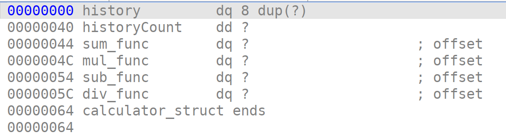
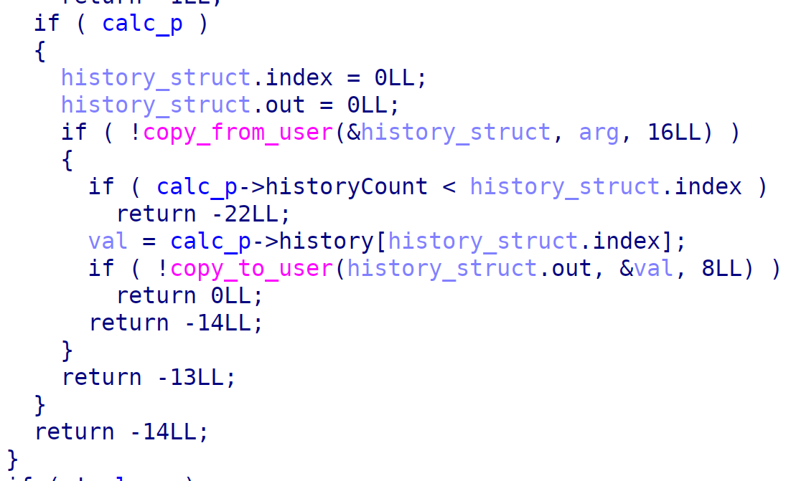
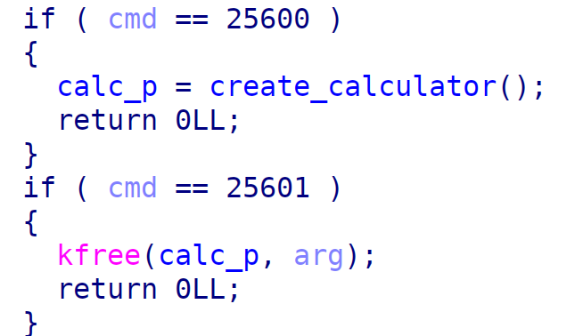

# calcEmAll | pwn

## Описание

Таск представляет из себя калькулятор в виде модуля, написанного для Linux. Игроку предоставляется шелл в систему под пользователем с uid=1000. Флаг находится в /root/flag.txt

Linux эмулируется посредством QEMU

Файловая система initramfs

Пользователю доступен стандартный набор утилит из busybox

## Решение 1 (как задумывал автор)

### Лик базы ядра (обход KASLR)

Перед эксплуатацией заметим, что все основные митигации включены - KASLR, SMEP, SMAP, KPTI. Единственное при подключении можно заметить сообщение `Spectre V2 : Kernel not compiled with retpoline; no mitigation available!`, что свидетельствует об отключении механизма retpoline, который является митигацией от уязвимости spectre. Но предусмотренное автором решение никак с этим не связано.

Исследуя код можно заметить, что калькулятор умеет сохранять посчитанные значения. При этом ёмкость истории значений равна 8  последним посчитанным числам.


В структуре есть также поле historyCount. Оно необходимо для поддержания количества значений в истории. Если количество значений достигает предела в 8, то последующие значения будут вставать в начало массива, все значения будут сдвигаться, последнее затирается.

При вызове метода чтения истории можно заметить, что есть проверка на то, что индекс не должен превышать количество значений в истории, но при этом index на входе является типом int64_t и может быть отрицательным, но проверки на отрицательность нет.



Это даёт возможность читать память, которая расположена перед нашим чанком. Недалеко от чанка можно найти адреса ядра. Вычитая из них оффсет от начала ядра мы можем получить базу.

### UAF -> Heap Spraying -> RCE

Изучая структуру калькулятора можно увидеть, что все операции лежат в виде указателей на функции. Также в функции ioctl можно заметить UAF. Через `cat /proc/slabinfo` можно узнать, в какие бины попадает структура. Размер её колеблется между 64 и 128. Значит она попадает в kmalloc-128. Размер структуры msg_msg попадёт в тот же бин. Её мы можем использовать для heap spraying.


Тогда примерный эксплойт будет следующим:

0. Ликаем базу ядра
1. Создаём структуру калькулятора
2. Фришим структуру калькулятора
3. Распыляем много структур msg_msg
4. Текст сообщения msg_msg попадает прямо на адреса функций калькулятора. Записываем туда адреса интересующего нас кода

Далее эксплойт может быть различный, но я решил просто переписать modprobepath, так как используется ядро версии 6.13, в котором его не сложно эксплуатировать.

5. В ядре я нашёл код, с помощью которого можно будет записать по произвольному адресу, так как на момент выполнения функции в регистре rax лежит адрес чанка калькулятора, а по смещению 0x30 находятся подконтрольные нам данные, куда мы ложим адрес на modprobepath
```asm
mov rax, qword ptr [rax + 0x30]
mov qword ptr [rsi + 0x40], rax
```
6. Далее стандартные для такого пути команды позволят принудительно вызвать modprobe от нашего записанного пути. Поэтому предварительно положим в наш файл полезную нагрузку (modprobe path я переписал на /tmp/x)
```bash
echo -ne "#!/bin/sh\ncat /root/flag.txt > /tmp/lol\n" > /tmp/x
echo -ne "\xFF\xFF\xFF\xFF" > /tmp/data
chmod +x /tmp/x /tmp/data
/tmp/data
cat /tmp/lol
```

[Лик адреса ядра](./data/sploit/leak_kernel_addr.c)

[Основной эксплойт](./data/sploit/exploit.c)

[Команды после эксплойта](./data/sploit.sh)

## Решение 2

После написания таска оказалось, что флаг лежит перед чанком с калькулятором (потому что используется initramfs, которая находится в оперативной памяти), что позволяет его прочитать просто перебрав отрицательные индексы. Флаг по идее недалеко находится от чанка, так что перебор не займёт много времени.

Эксплойт для этого способа не представлен.